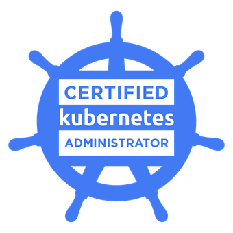
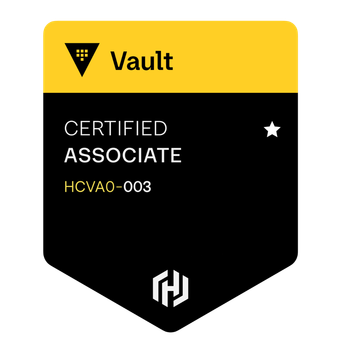

{.md}
## Tim Harrison 

{.md}
### Principal Security Engineer { .md }

## About Me

Aim: A Principal Security Engineer with over 10 years of experience in the security, infrastructure, and DevOps space with a proven track record of leading incident response, building detection capabilities, and enhancing cloud security posture.

---

## Key Technical Skills 

Languages: Golang, Python, Bash.

Cloud: AWS (including a wide range of security services), GCP (GKE).

Security Tools: Datadog, Wiz, Google SecOps, Hashicorp Vault, GitHub Advanced Security, Cloudflare.

DevSecOps: GitHub Actions, Gitlab CI, Teamcity, Jenkins, ArgoCD, FluxCD.

Infrastructure: Kubernetes, Terraform, Docker.

Networking: Cloud as well as on-premise networking, VPNs, Firewalls, Proxies, Load Balancers.

---

## Achievements

Proactive Threat Intelligence: I regularly review emerging threats and IOCs for various attack vectors, such as the recent npm hack, and proactively build detections to ensure robust pre-emptive coverage across our cloud estates.

Security Observability: Led the implementation of security observability across our cloud infrastructure, consolidating SCM, infrastructure, and AppSec alerts into a single pane of glass. Recently led the migration of our primary security posture from Datadog to Wiz. Used this tooling to remediate high profile vulnerabilities and misconfigurations, with a focus on improving our overall security posture.

Incident Response: I have extensive experience at leading high severity incidents, including communication to senior members of staff, detailed timelines and incident reporting (retrospective). I am adept at working with Security Information and Event Management (SIEM) solutions to help identify and triage security incidents.

Security Automation: Took ownership of and drove the full implementation of GitHub Advanced Security (GHAS) for an Enterprise account of 300 developers (including writing of custom secret scanning patterns and deployment of workflows to all org repositories). Deployed various security tools and automations to automate repetitive security tasks, improving the security posture of the environment and reducing manual toil.

Threat Modelling: Delivered a comprehensive threat modelling initiative across the company, providing teams with the tooling and processes to identify and mitigate risks.

Cost Savings: Drove cost-saving initiatives by migrating CI/CD pipelines to GitHub Actions and implementing self-hosted runners, reducing cloud spend and improving resource tagging for better cost allocation.

Internal Tooling: Developed a custom Slack-based tool to resolve a longstanding engineering communication issue, creating a frictionless way for developers to communicate changes to the wider business.

---

## Employment History

Smart Pensions (January 2025 - Present) Principal Security Engineer:
* Led security management for the wider Smart Pensions estate, focusing on security observability and compliance.
* Managed external auditors to ensure compliance with security policies, including the successful delivery of ISO27001 and current work towards SOC2.
* Consulted with various teams across the business to ensure appropriate security tooling and processes were in place for their services.

Smart Pensions (September 2022 - January 2025) DevSecOps | DevEx Tech Lead:
* Led a DevSecOps | DevEx team focused on improving the security posture of the environment through tooling and processes.
* Drove the deployment of GitHub Advanced Security across a GitHub Enterprise account to shift security responsibility left to development teams.
* Wrote Terraform modules and used AWS tooling (Security Hub, Config, Guardduty) to improve infrastructure security and highlight non-compliance.
* Managed the team that took stewardship of GitHub, Cloudflare, and aspects of AWS, providing "platform as a service" to the wider engineering team.

Ometria (April 2022 - September 2022) Infrastructure Team Lead:
* Led a team of infrastructure engineers supporting the cloud estate.
* Standardized team documentation and processes, improving workflows based on internal feedback.
* Managed daily standups, 1-1s, and project status calls to ensure alignment and clear communication.

Smart Pensions (December 2021 - April 2022) InfraSec Tech Lead:
* Led a team of 3 Infrastructure engineers focused on ensuring the security of our cloud estate (Primarily AWS).
* Designed and led infrastructure projects and handled technical escalations.
* Provided individual coaching to junior team members to improve their technical skills and cycle time.

Smart Pensions (April 2021 - December 2021) Senior DevOps Engineer (Platform Security Team):
* Worked on a 20+ member DevOps team, building and securing AWS infrastructure via IaC (Terraform).
* Led high-priority security incidents, including detailed timeline creation and post-mortem analysis.
* Served as the primary security support engineer, responding to and triaging alerts from Datadog.

Xara LTD (Jan 2017 - April 2021) Senior Sysadmin

## Hobbies

Personal Projects: In the evenings I enjoy working on personal coding projects (primarily Golang, Python), deploying via automation into Kubernetes. Recently I have been working on a project to improve my observability using Prometheus to deliver alert events to Kafka to be remediated by a custom Golang application.

Medium.com: I write articles on Medium about my personal projects and experiences in the tech industry. [tjtharrison.medium.com](https://tjtharrison.medium.com)
