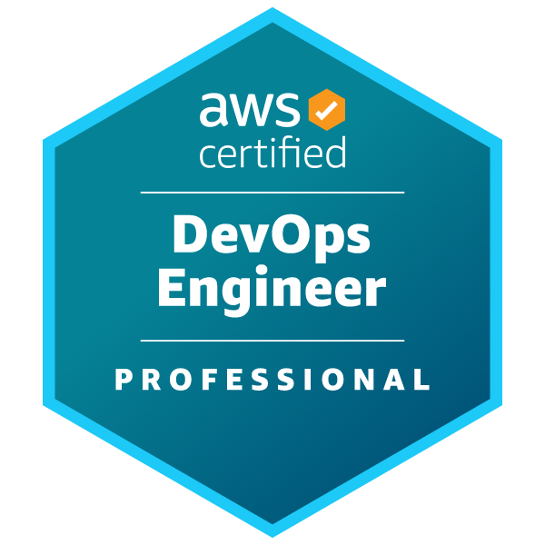

## Tim Harrison { .md }
### DevSecOps Tech Lead { .md }

## About Me

Aim: To use my technical expertise and excellent communication skills to help lead a team achieve success.

A self-motivated team player with experience in heavily technical and client facing account management roles. An excellent communicator (both written and verbal) and have an ability to form close relationships with internal team and external shareholders.

I have a strong technical background working in Fintech and a proven understanding of Cloud Infrastructure (AWS, Security, Kubernetes, Docker etc - More details below). I have ability to make strategic decisions under time and budget constraints and execute reliably.

## Key Leadership Skills

Team Leadership: I have 4 years leadership experience with varying levels of technically skilled team members, requiring leadership skills (technical growth, specialising etc). I have worked leading Infrastructure, DevOps and Development teams in both Kanban and Scrum methodologies and am a strong believer in supporting principals for Agile development.

Mentorship: I take pride in working with all members of the team to improve their technical understanding and confidence. I also  volunteer on [Cyber Mentor Dojo](https://cybermentordojo.com/), helping others starting out on their Security careers to focus their learning and answer any questions (Technical or Career specific).

Team Management: Experienced with working in technical management positions including running meetings, refinement /  estimation sessions, kanban games, retrospectives, annual performance reviews, 1-1s etc.

Communication Skills:  Building good relationships with team members, wider company and third party providers. Confident hosting demo / presentations to clients or internal teams to help provide a better understanding of solutions provided by the team. Experience with stakeholder meetings and translating asks into actionable items for the team.

Project Management: Wealth of project management experience (both as technical SME and co-ordination). This includes (non-exhaustively) a full SOC and SIEM implementation, P2V (physical > virtual server migrations), Cloud migrations (On-prem to AWS), Office 365 migrations, brand development (Inc website, corporate branding, marketing campaigns) working to tight deadlines with close customer contact.

Documentation: In all teams I have lead, I have built up a strong collection of documentation based on projects and applications we have built as a team, runbooks for routine tasks, internal processes / ways of working and diagrams for implemented solutions. I find this is the most efficient way to onboard new team members and help existing team members gain experience with new services. I am profficient in writing sequence diagrams to help explain technical solutions to a wider audidence within the company.

## Key Technical Skills 

DevSecOps: Experienced at working with development teams to improve the security of the SDLC in using tooling and processes, strong believer in shift-left, empowering development teams to own their code security with appropriate documentation and training. Seasoned user of Github security functionality (GHAS, audit logging, actions, workflows) and have written a custom lambda function to poll GitHub api and generate reporting and metrics in Datadog for account health over time.

Cloud Security: Proven experience working with security services within AWS (AWS Config, Cloudtrail, Security Hub, Guardduty etc). As part of my role as Security Infrastructure lead I also ran incident response for high severity incidents and wrote mitigating runbooks for Cloud security incidents.

Cloud Management: I have over 6 years experience working with AWS across a wide range of services (Including security / compliance focus) with AWS Certs in DevOps Professional / Security Specialist and am currently working towards my Advanced Networking Specialist certificate. Experience working with GCP (Including GKE, Networking), Azure (limited) and other smaller Cloud Providers (Scaleway, Digital Ocean etc) as well as code hosting platforms such as Heroku.

DevOps / Automation: I am a strong believer in DevOps principals and ways of working - Encouraging automation to ensure compliance / standardisation. Developing / improving CI/CD pipelines (Experience with Github Actions, Gitlab CI, Teamcity, Jenkins, ArgoCD) deploying both application (Python, NodeJS) and infrastrucutre code (Helm, EKS, GKE, Terraform, Ansible).

Network Management: I have over 10 years experience working designing / building and supporting networks (On prem / Datacenter / Hybrid Cloud / Pure Cloud) including a strong understanding of supporting technologies (DHCP, DNS, routing, firewalls, logging, SSL Certificates, VPNs).

Server Management: I also have over 10 years experience building / supporting and monitoring servers (Physical / Virtual / Cloud) across a range of Operating Systems (Windows / Linux / BSD). I am confident using Configuration as Code packages (eg Ansible) to deploy and manage workloads. 

Coding: Competent coder in a set of languages (Bash, Python). I am comfortable using code Versioning tools (Gitlab, Github, SVN).

## Acheivements

AWS Security Specialist: I have completed my AWS Security Specialist certification. This covered a wide range of security focused services on AWS and has helped me with my day to day work implementing solutions on AWS to improve security posture.

AWS DevOps Professional: I have recently completed my AWS DevOps Professional certification. This has helped establish my knowledge over a range of AWS services related to CI/CD pipelines, audits, monitoring and logging.

DevSecOps - Github Hardening Took ownership of Github Enterprise account and improve security across the board, using GHAS (Github Advanced Security - Including Custom secret scanning and CodeQL). Implemented monitoring using Datadog and 

DevOps - CI/CD Implementation: Built a CI/CD Pipeline from design through to implementation with requirements from team leaders - Combining Gitlab, Jenkins Multibranch Pipelines, Helm, Kubernetes, Slack, Jira (Transitions, RemoteLinks, Comments) and Private NPM Repository.

Consultancy Business and Tech Article Website Worked (amongst other clients) with a local charity and assisted migrating away from legacy infrastructure to office 365. Currently maintain a website of tech articles that consistently gets >500 Unique visitors per week.

Bespoke Website with Database: Wrote a web application based in Python for Music Management startup, including Python Web UI (With account permissions), database backend (to Cloud hosted Database).

## 5 Years Employment History

Smart Pensions (April 2022 - September 2022) DevSecOps Tech Lead: I currently lead a DevSecOps team focusing on improving Security of the Smart Pensions environment through implementation and improvement of tooling and processes.

I have lead the deployment of GitHub Advanced Security across a GitHub Enterprise account, ensuring full coverage of tooling and supporting processes and documentation were in place to "Shift left" security responsibility to the owning development teams. GitHub security is monitored via Audit logs and a custom lambda that I have written to poll the Github API for compliance with our requirement across the Enterprise account (Alerting misconfiguration to relevant teams depending on priority).

I am continuing to improve and assist on the Infrastructure security on AWS writing Terraform modules and using AWS Tooling (AWS Security Hub, AWS Config, AWS Guardduty) to highlight non-compliance.

I am building a single plane of glass approach to monitoring - Consolidating SCM, infrastructure and appsec alerting into Datadog, using Datadog security functionality to aggregate and triage alerting to the appropriate owning team.

Ometria (April 2022 - September 2022) Infrastructre Team Lead: I lead a team of infrastructure engineers supporting the cloud estate and engineering team for Ometria. 

I worked with the infrastructure team to build out a ways of working and standardise on documentation. We used the feedback from the ways of working to understand issues that the team was having and implemented processes to assist.

I ran daily standups, 1-1s and retrospectives/refinement sessions while joining weekly project status calls to feedback infrastructure project status to the wider project team.

Smart Pensions (December 2021 - April 2022) InfraSec Tech Lead: I lead a team of 3 Infrastructure engineers with a team focus on ensuring the Infrastructure Security of our Cloud estate (Primarily AWS). This involves initialising, designing and leading infrastructure projects, attending meetings, handling technical escalations as well as team management.

I ran daily standups, 1-1s, individual coaching sessions with junior team members as well as retrospective sessions. The focus being to highlight where improvements can be made on the team's working environment and cycle time for tickets for our internal and external clients.

Smart Pensions (April 2021 - December 2021) Senior DevOps Engineer (Platform Security Team): I worked as part of a wider DevOps team of 20+ engineers, working on a range of technologies building, supporting and securing AWS via IAC (Terraform). I work in the Platform Security sub-team, working on implementing various AWS security infrastructure modules (AWS Config, Cloudtrail, Guardduty) including management of alerts via Datadog to our team chat platform. 

Here I lead a number of high priority security incidents, including communication to senior members of staff, detailed timelines and incident reporting (Post Mortem analysis) and am the primary security support engineer (responding to alerts from Datadog and assessing before deciding on resolution path).

Xara LTD (Jan 2017 - April 2021) Senior Sysadmin / Devops Team Lead: Lead a team which migrated all inhouse baremetal servers to AWS hosted EKS clusters. Managed 24/7 production infrastructure support and assisted migration of application middleware to docker/kubernetes.

I lead the building of our internal DevOps team focusing on migrating services to Kubernetes (Including backups, monitoring, deployment and scaling). Replaced Teamcity CD solution with complete CI/CD solution based on Jenkins.

iQuda (Jan 2011 - Jan 2017) Various Roles (Service Desk Management / Level 3 Technician).

## Hobbies

DIY: While away from the Computer I spend my time working on DIY projects around the house.

Personal Projects: In the evenings I enjoy working on personal coding projects (primarily Python3), deploying via Terraform into AWS.

Coding Games: I also spent time on coding websites such as [https://codingame.com](https://codingame.com) which helps me improve my coding efficiency.
