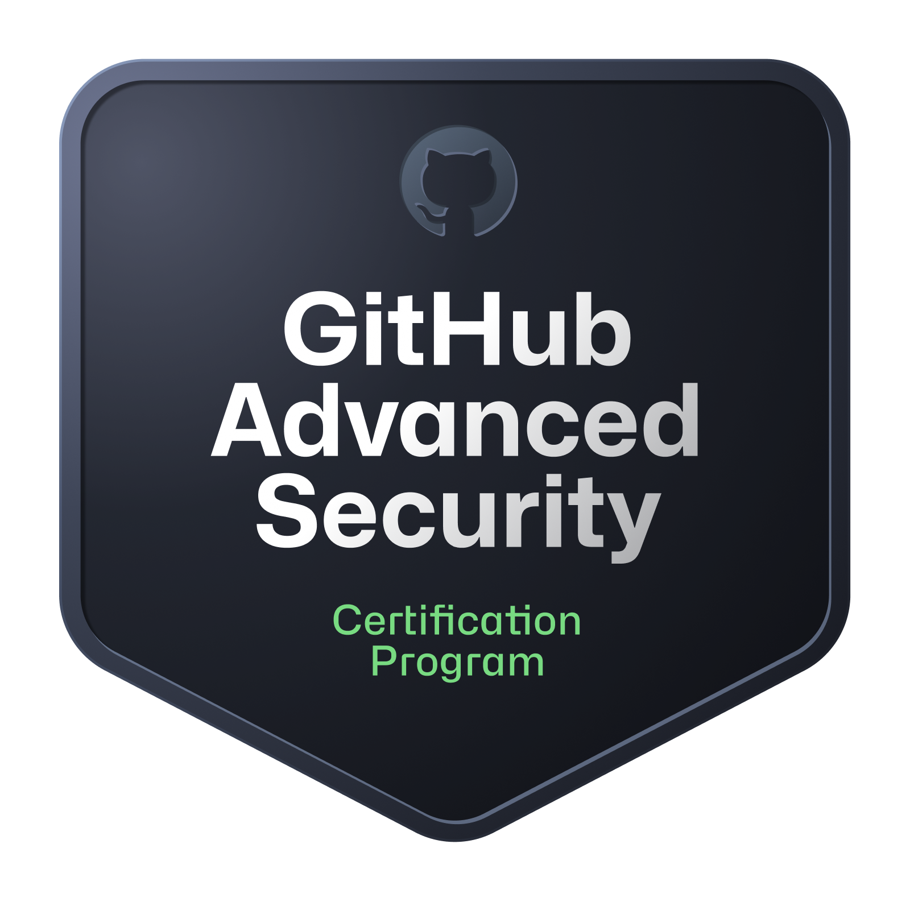

## Tim Harrison { .md }
### DevSecOps Tech Lead { .md }

## About Me

Aim: To use my technical expertise and excellent communication skills to help lead a team achieve success.

A self-motivated team player with experience in heavily technical and client facing account management roles. An excellent communicator (both written and verbal) and have an ability to form close relationships with internal team and external shareholders.

I have a strong technical background working in Fintech and a proven understanding of Cloud native Infrastructure (AWS, Security, Kubernetes, Datadog, GitHub - More details below). I have ability to make strategic decisions under time and budget constraints and execute reliably.

## Key Leadership Skills

Team Leadership: I have 10 years leadership experience with varying levels of technically skilled team members, requiring leadership skills (technical growth, specialising etc). I have worked leading Infrastructure, Security, DevOps and Development teams in both Kanban and Scrum methodologies and am a strong believer in supporting principals for Agile development.

Mentorship: I take pride in working with all members of the team to improve their technical understanding and confidence. I also  volunteer on [Cyber Mentor Dojo](https://cybermentordojo.com/), helping others starting out on their Security careers to focus their learning and answer any questions (technical or career specific).

Team Management: Experienced with working in technical management positions including running meetings, refinement /  estimation sessions, kanban games, retrospectives, annual performance reviews, 1-1s etc.

Communication Skills:  Building good relationships with team members, wider company and third party providers. Confident hosting demo / presentations to clients or internal teams to help provide a better understanding of solutions provided by the team. Experience with stakeholder meetings and translating asks into actionable items for the team.

Project Management: Wealth of project management experience (both as technical SME and co-ordination). This includes (non-exhaustively) a full SOC and SIEM implementation, P2V (physical > virtual server migrations), Cloud migrations (On-prem to AWS), Office 365 migrations, brand development (Inc website, corporate branding, marketing campaigns) working to tight deadlines with close customer contact.

Documentation: In all teams I have lead, I have built up a strong collection of documentation based on projects and applications we have built as a team, runbooks for routine tasks, internal processes / ways of working and diagrams for implemented solutions. I find this is the most efficient way to onboard new team members and help existing team members gain experience with new services. I am proficient in writing sequence diagrams to help explain technical solutions to a wider audience within the company.

## Key Technical Skills 

DevSecOps: Experienced at working with development teams to improve the security of the SDLC in using tooling and processes, strong believer in shift-left, empowering development teams to own their code security with appropriate documentation and training. Seasoned user of GitHub security functionality (GHAS, audit logging, actions, workflows) and have written a custom lambda function to poll GitHub api and generate reporting and metrics in Datadog for account health over time, highlight non-compliance etc.

Cloud Security: Proven experience working with security services within AWS (AWS Config, Cloudtrail, Security Hub, Guardduty etc). As part of my role as Security Infrastructure lead I also ran incident response for high severity incidents and wrote mitigating runbooks for Cloud security incidents

Cloud Management: I have over 6 years experience working with AWS across a wide range of services (Including security / compliance focus) with AWS Certs in DevOps Professional / Security Specialist and am currently working towards my Advanced Networking Specialist certificate. Experience working with GCP (Including GKE, Networking), Azure (limited) and other smaller Cloud Providers (Scaleway, Digital Ocean etc.) as well as code hosting platforms such as Heroku.

Cloud Monitoring (including security): I ensure that any new tooling implemented has sufficient monitoring in place to ensure functionality and security is maintained (Including actions required / runbooks / automation to resolve). I am experienced with Cloud native monitoring (Cloudwatch, Datadog) and with writing appropriate custom monitoring for in-house packages or bespoke solutions.

DevOps / Automation: I am a strong believer in DevOps principals and ways of working - Encouraging automation to ensure compliance / standardisation. Developing / improving CI/CD pipelines (Experience with GitHub Actions, Gitlab CI, Teamcity, Jenkins, ArgoCD) deploying both application (Python, NodeJS) and infrastructure code (Helm, EKS, GKE, Terraform, Ansible).

Network Management: I have over 10 years experience working designing / building and supporting networks (On prem / Datacenter / Hybrid Cloud / Pure Cloud) including a strong understanding of supporting technologies (DHCP, DNS, routing, firewalls, logging, SSL Certificates, VPNs).

Server Management: I also have over 10 years experience building / supporting and monitoring servers (Physical / Virtual / Cloud) across a range of Operating Systems (Windows / Linux / BSD). I am confident using Configuration as Code packages (eg Ansible) to deploy and manage workloads. 

Coding: Competent coder in a set of languages (Bash, Python). I am comfortable using code Versioning tools (Gitlab, Github, SVN).

## Acheivements

AWS Security Specialist: I have completed my AWS Security Specialist certification. This covered a wide range of security focused services on AWS and has helped me with my day-to-day work implementing solutions on AWS to improve security posture.

AWS DevOps Professional: I have recently completed my AWS DevOps Professional certification. This has helped establish my knowledge over a range of AWS services related to CI/CD pipelines, audits, monitoring and logging.

DevSecOps - Github Advanced Security Took ownership of a project to implement GHAS (GitHub Advanced Security) to an Enterprise account (including writing of custom secret scanning patterns and deployment of workflows to all org repositories). Wrote supporting documentation and provided training to assist with the onboarding for development and security teams. Implemented monitoring of GitHub estate using Datadog with triaging and delivery of notifications to owning teams using Audit logs and custom tooling written to audit compliance of GitHub resources. 

DevOps - CI/CD Implementation: Built a CI/CD Pipeline from design through to implementation with requirements from team leaders - Combining Gitlab, Jenkins Multibranch Pipelines, Helm, Kubernetes, Slack, Jira (Transitions, RemoteLinks, Comments) and Private NPM Repository.

DevOps - Kubernetes: I have a wealth of experience working with Kubernetes, including building and managing clusters on AWS (EKS) and GCP (GKE). I have worked with a range of tools to manage Kubernetes clusters including Helm, ArgoCD and Terraform.

Security - Hashicorp Vault: I have completed my Hashicorp Certified: Vault Associate certification. This has helped me to understand how to implement and manage secrets management solutions using Hashicorp Vault, including integration with Kubernetes, GitHub and other cloud services.

## Employment History

Smart Pensions (January 2025 - Present) Principal Security Engineer: I have maintained my responsibilites from my previous role as DevSecOps | DevEx Tech Lead, with additional responsibilities for the wider security of the Smart Pensions estate.

I have taken on the responsibility of managing the security of the Smart Pensions estate, including the implementation of security observability across the Smart Pensions cloud infrastructure, ensuring that all cloud tooling has appropriate security monitoring in place so that the appropriate team is alerted to any issues that may arise. 

This has included consulting with various teams across the business to ensure that the appropriate security tooling and processes are in place for their services.

I have recently delivered an initiative to deliver a process for threat modelling across the Smart Pensions estate, including delivering tooling and processes to allow teams to easily threat model their services and ensure that appropriate mitigations are in place for any identified risks.

I am heavily involved in our audit and compliance processes, including working with our external auditors to ensure that we are compliant with our security policies and procedures. This has included delivering ISO27001 compliance and currently working towards SOC2 compliance.

Smart Pensions (September 2022 - January 2025) DevSecOps | DevEx Tech Lead: I lead a DevSecOps | DevEx team focusing on improving Security of the Smart Pensions environment through implementation and improvement of tooling and processes, while also improving the developer experience and relationship with security teams across the engineering community.

I have lead the deployment of GitHub Advanced Security across a GitHub Enterprise account, ensuring full coverage of tooling and supporting processes and documentation were in place to "shift left" security responsibility to the owning development teams with appropriate automated escalation of longstanding issues to the engineering management team.

I have also lead the team to implement Security observability across the Smart Pensions cloud infrastructure, ensuring that all cloud tooling has appropriate security monitoring in place so that the appropriate team is alerted to any issues that may arise. This has involved threat modelling, writing custom monitoring and runbooks for our monitors in Datadog and ensuring that the right team is aware of the alerts and how to respond to them.

I am continuing to improve and assist on the infrastructure security on AWS writing Terraform modules and using AWS Tooling (AWS Security Hub, AWS Config, AWS Guardduty) as well as other platforms (GitHub, Cloudflare, Dnsimple) to highlight non-compliance and issues that present a risk to the Smart Pensions estate. 

I am building a single plane of glass approach to monitoring - Consolidating SCM, infrastructure and AppSec alerting into Datadog, using Datadog security functionality to aggregate and triage alerting to the appropriate owning team.

I have taken on additional responsibilities as the DevEx Tech Lead, focusing on improving the Developer Experience across the Smart Pensions estate. This split responsibility has given me valuable insight into both leading a team with different stakeholders, as well as a different perspective on the wider engineering team's requirements.

My team has taken stewardship of GitHub, Cloudflare and aspects of AWS and provide "platform as a service" to the wider engineering team. By configuring all aspects of the cloud that we manage (including GitHub Actions, Workflows, GHAS, Audit Logging, Branch Protection, Code Owners etc) to be defined as IAC in Terraform to improve auditability and compliance on changes as well as ease of use. 

My team completed a migration of all CI/CD pipelines from Semaphore CI to GitHub Actions, with the aim to consolidate all CI/CD pipelines into a single platform as well as reducing spend on CI/CD.

I have driven cost saving initiatives across our Cloud estate, including migrating to GitHub self hosted runners, improved observability of spend across the estate and improved tagging of resources to allow for better cost allocation.

I have lead the development of a slack based tool to resolve a longstanding issue across engineering to communicate changes to the wider business. This has allowed a frictionless way for developers to easily communicate changes to the wider business and ensure that the appropriate stakeholders are informed of changes that may impact them, as well as providing a searchable history of changes that have been made.

Ometria (April 2022 - September 2022) Infrastructre Team Lead: I lead a team of infrastructure engineers supporting the cloud estate and engineering team for Ometria. 

I worked with the infrastructure team to build out a ways of working and standardise on documentation. We used the feedback from the ways of working to understand issues that the team was having and implemented processes to assist.

I ran daily standups, 1-1s and retrospectives/refinement sessions while joining weekly project status calls to feedback infrastructure project status to the wider project team.

Smart Pensions (December 2021 - April 2022) InfraSec Tech Lead: I lead a team of 3 Infrastructure engineers with a team focus on ensuring the Infrastructure Security of our Cloud estate (Primarily AWS). This involves initialising, designing and leading infrastructure projects, attending meetings, handling technical escalations as well as team management.

I ran daily standups, 1-1s, individual coaching sessions with junior team members as well as retrospective sessions. The focus being to highlight where improvements can be made on the team's working environment and cycle time for tickets for our internal and external clients.

Smart Pensions (April 2021 - December 2021) Senior DevOps Engineer (Platform Security Team): I worked as part of a wider DevOps team of 20+ engineers, working on a range of technologies building, supporting and securing AWS via IAC (Terraform). I work in the Platform Security sub-team, working on implementing various AWS security infrastructure modules (AWS Config, Cloudtrail, Guardduty) including management of alerts via Datadog to our team chat platform. 

Here I lead a number of high priority security incidents, including communication to senior members of staff, detailed timelines and incident reporting (Post Mortem analysis) and am the primary security support engineer (responding to alerts from Datadog and assessing before deciding on resolution path).

Xara LTD (Jan 2017 - April 2021) Senior Sysadmin / Devops Team Lead: Lead a team which migrated all inhouse baremetal servers to AWS hosted EKS clusters. Managed 24/7 production infrastructure support and assisted migration of application middleware to docker/kubernetes.

I lead the building of our internal DevOps team focusing on migrating services to Kubernetes (including backups, monitoring, deployment and scaling). Replaced Teamcity CD solution with complete CI/CD solution based on Jenkins including flexible and reusable pipelines for all services and teams.

iQuda (Jan 2011 - Jan 2017) Various Roles (Service Desk Management / Level 3 Technician).

## Hobbies

DIY: While away from the Computer I spend my time working on DIY projects around the house.

Personal Projects: In the evenings I enjoy working on personal coding projects (primarily Golang, Python), deploying via automation into Kubernetes. Recently I have been working on a project to improve my observability using Prometheus to deliver alert events to Kafka to be remediated by a custom Golang application. 

# Write a piece about medium.com
Medium.com:Over the past year I have spent time writing articles on Medium.com to help share my knowledge with a wider audience. I have written articles on a range of topics including AWS, DevOps, Security and Python. I have found this to be a great way to help others learn and to help me solidify my own knowledge.

Cyber Mentor Dojo: I volunteer on Cyber Mentor Dojo, helping others starting out on their Security careers to focus their learning and answer any questions (technical or career specific).

## Coding stats

Here are some stats about the languages I've used over the last 30 days.

<figure style="max-width: 500px;margin: 0 auto;"><embed src="https://wakatime.com/share/@1c3347e8-db83-4a0d-8126-665673d32651/faae122d-f6c6-4f09-b036-5b9e15884011.svg"></embed></figure>